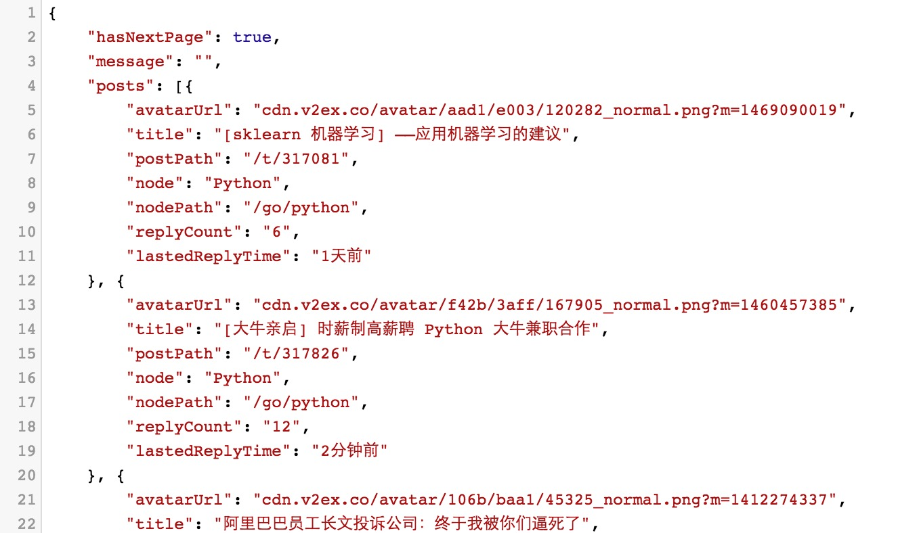

# V2exServer
a node.js crawler

js，node.js初学，这个爬虫用来爬取[v2ex](https://www.v2ex.com/)的帖子和评论等内容。为我的第三发客户端[OpenV2ex](https://github.com/shellljx/OpenV2ex-android)
提供数据。

详细请看[API文档](./api_doc.md)



#Install
```
git clone git@github.com:shellljx/V2exServer.git
cd V2exServer
npm install
```

then

```
node v2ex.js
```
